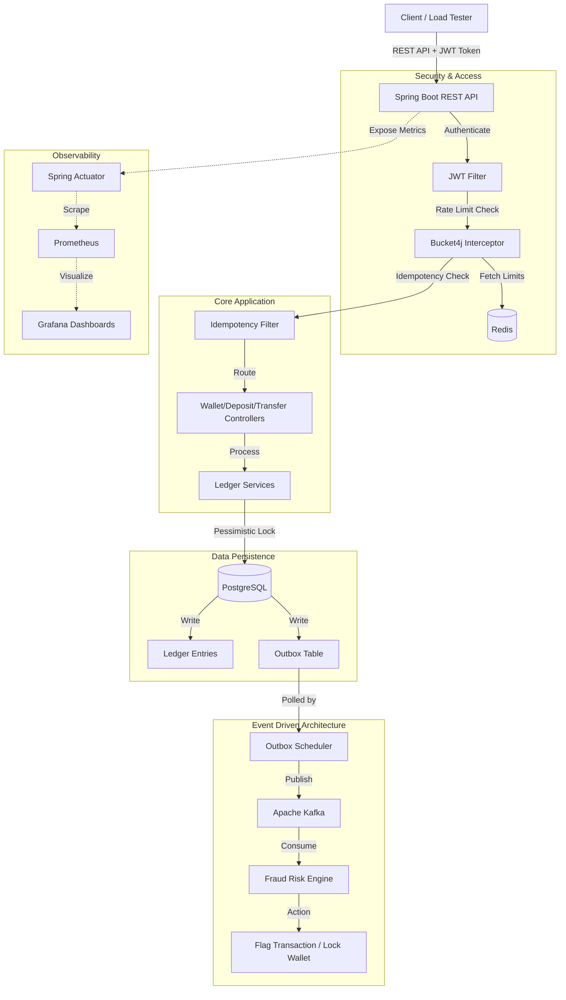

# Payflow

Payflow is a robust, production-ready digital wallet and ledger application. It provides secure financial transactions—including deposits, withdrawals, and peer-to-peer transfers—while maintaining strict data integrity and consistency.

## What Problem Does It Solve?
Building financial applications is notoriously difficult because data consistency is paramount. A simple database update is not enough when dealing with money. Traditional applications often suffer from:
- **Race Conditions:** Users withdrawing money simultaneously leading to negative balances.
- **Lost Transactions:** System crashes causing money to disappear in transit.
- **Lack of Auditability:** Difficulty tracking exactly where money came from and where it went.

**Payflow** solves these problems by implementing a **Double-Entry Ledger** architecture. Instead of just updating a "balance" column, every financial movement is recorded as an immutable ledger transaction with balancing credit and debit entries. This ensures strict auditability—the sum of all balances always equals zero, making money creation or destruction mathematically impossible outside of authorized deposit/withdrawal flows.

## What Makes It Unique?
- **Double-Entry Ledger Architecture:** Financial-grade transaction tracking ensuring zero data anomalies.
- **Idempotent API Design:** All state-mutating endpoints enforce idempotency. If a user's network drops and they click "Transfer" twice, they are guaranteed to only be charged once.
- **Event-Driven Fraud Detection:** Built with an Outbox Pattern and Apache Kafka. Every transaction seamlessly publishes events to a message broker, where isolated fraud-detection consumers analyze velocity and transaction amounts asynchronously without blocking the main user flow.
- **Pessimistic Database Locking:** Prevents concurrent transaction anomalies (like double-spending) at the database row level.

## Architecture Flow



## Tech Stack & Core Libraries

- **Java 17 & Spring Boot 3:** Provides a robust, enterprise-grade backend framework.
- **PostgreSQL:** Acts as the primary data store. Utilized for its strong ACID compliance and row-level locking capabilities, which are critical for the double-entry ledger.
- **Apache Kafka:** Serves as the event broker. Decouples core financial transactions from secondary processes like the Fraud Risk Engine, allowing the main transfer API to remain extremely fast.
- **Bucket4j & Redis:** Implements strict API Rate Limiting to prevent DDoS attacks and spam on financial endpoints.
- **JSON Web Tokens (JWT):** Secures the API using stateless authentication.
- **Flyway:** Manages and versions the database schema changes (`V1__init_schema.sql`), ensuring strict schema enforcement over fragile Hibernate auto-updates.
- **K6:** Used for heavy load testing to verify TPS (Transactions Per Second) and p95 latency under high concurrency.
- **Prometheus & Grafana:** Hooks into Spring Actuator to provide real-time observability over JVM metrics, database connection pools, and API latency.

## How to Run This Project

### Prerequisites
- Docker & Docker Compose
- Java 17
- Maven

### 1. Start Infrastructure (Database & Message Broker)
First, spin up PostgreSQL and Apache Kafka using Docker:
```bash
docker compose up -d
```

### 2. Start the Application
Run the Spring Boot application:
```bash
mvn spring-boot:run "-Dmaven.test.skip=true"
```

### 3. Test the APIs
Once the application says `Started PayflowApplication`, open the interactive Swagger UI in your browser:
**[http://localhost:8081/swagger-ui.html](http://localhost:8081/swagger-ui.html)**

1. **Create User:** Use the `User Controller` to create an account and copy the returned User ID.
2. **Create Wallet:** Use the `Wallet Controller` to attach a USD wallet to your User ID.
3. **Deposit Funds:** Use the `Deposit Controller` to add money to your wallet.
4. **Transfer Funds:** Create a second wallet and use the `Transfer Controller` to safely send money between them.

All transactions will instantly be safely recorded in the double-entry ledger!

Screeshot


